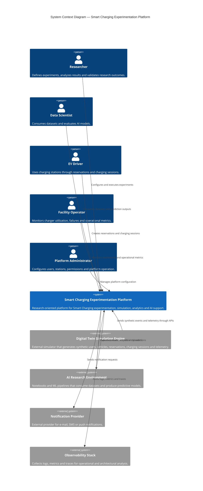

# SPEC-002 — Context Diagram

## Smart Charging Experimentation Platform (SCEP)

**Status:** Approved

**Version:** 1.0

**Document Owner:** Project Team

**Last Update:** 2026

---

# 1. Purpose

This document presents the **C4 Model Level 1 — System Context Diagram** for the **Smart Charging Experimentation Platform (SCEP)**.

The objective of this document is to describe how SCEP fits into its external environment, identifying:

* primary users;
* external systems;
* data producers;
* data consumers;
* system boundaries;
* responsibilities outside the platform.

This document does not describe internal containers, modules, databases or implementation details. Those topics are covered in subsequent architecture documents.

---

# 2. System Context

SCEP is a research-oriented platform designed to support experimentation in Smart Charging systems.

It enables researchers, developers and data scientists to execute controlled scenarios, generate synthetic operational data, analyze charging behavior and validate AI-based approaches without requiring physical electric vehicle charging infrastructure.

The platform exposes APIs and user interfaces for interacting with the Smart Charging domain, while external actors and systems consume its capabilities for experimentation, analytics and operational decision-making.

---

# 3. System Boundary

SCEP is responsible for:

* managing Smart Charging domain data;
* exposing APIs for reservations, charging sessions and telemetry ingestion;
* persisting domain events;
* producing operational datasets;
* exposing dashboards and metrics;
* supporting AI experimentation;
* providing observability data.

SCEP is not responsible for:

* physically controlling real chargers;
* processing payments;
* sending real SMS, e-mail or push notifications in the MVP;
* executing large-scale model training infrastructure;
* implementing OCPP or proprietary charger protocols;
* integrating with real energy market systems.

---

# 4. Primary Actors

## 4.1 Researcher

The Researcher is the main academic user of the platform.

Responsibilities:

* define experimental scenarios;
* execute experiments;
* analyze generated datasets;
* evaluate architectural behavior;
* compare results across different simulation runs;
* support the academic validation of the project.

The Researcher represents the primary motivation for the platform.

---

## 4.2 Data Scientist

The Data Scientist consumes datasets and analytical outputs generated by SCEP.

Responsibilities:

* extract datasets;
* train predictive models;
* evaluate model performance;
* compare prediction strategies;
* analyze occupancy, demand and charging patterns;
* feed prediction results back into the platform.

The first AI experiment supported by the platform is charger occupancy prediction.

---

## 4.3 EV Driver

The EV Driver represents the business-domain user.

Responsibilities:

* check charger availability;
* create reservations;
* cancel reservations;
* start charging sessions;
* finish charging sessions;
* view charging history.

In the first versions of the project, EV Driver behavior may be simulated by the Digital Twin Simulation Engine.

---

## 4.4 Facility Operator

The Facility Operator manages the charging infrastructure from an operational perspective.

Responsibilities:

* monitor charger utilization;
* inspect occupancy metrics;
* identify demand peaks;
* follow operational dashboards;
* analyze failures and maintenance indicators.

Examples:

* condominium manager;
* corporate parking administrator;
* university campus operator.

---

## 4.5 Platform Administrator

The Platform Administrator manages technical and administrative aspects of SCEP.

Responsibilities:

* manage users and permissions;
* configure charging stations;
* manage platform settings;
* monitor system health;
* inspect logs, traces and metrics;
* maintain the development and experimentation environment.

---

# 5. External Systems

## 5.1 Digital Twin Simulation Engine

The Digital Twin Simulation Engine is an external system that produces synthetic Smart Charging behavior.

It interacts with SCEP through public APIs, just as real external devices or clients would.

Responsibilities:

* simulate EV drivers;
* simulate vehicles;
* simulate reservations;
* simulate charging sessions;
* simulate telemetry events;
* simulate charger failures;
* simulate maintenance windows;
* simulate peak demand;
* generate reproducible experimental scenarios.

The Simulation Engine is intentionally external to SCEP.

This decision allows the platform to treat simulated devices, test clients and future real chargers as equivalent external producers of events.

---

## 5.2 AI Research Environment

The AI Research Environment consumes data generated by SCEP for model development and evaluation.

Examples:

* Python notebooks;
* ML scripts;
* experiment pipelines;
* model evaluation tools.

Responsibilities:

* consume historical datasets;
* train models;
* validate predictions;
* produce model evaluation reports;
* optionally publish prediction results back to SCEP.

In the MVP, this environment may be represented by local notebooks and Python scripts.

---

## 5.3 Notification Provider

The Notification Provider represents external messaging infrastructure.

Examples:

* e-mail provider;
* SMS gateway;
* push notification service.

In the MVP, notifications may be mocked or logged instead of actually sent.

---

## 5.4 Observability Stack

The Observability Stack collects technical telemetry emitted by SCEP.

Examples:

* Prometheus;
* Grafana;
* Loki;
* Tempo;
* OpenTelemetry Collector.

Responsibilities:

* collect metrics;
* collect logs;
* collect traces;
* provide dashboards;
* support operational and architectural analysis.

Although deployed together in the local development environment, the observability stack is treated as an external supporting system.

---

# 6. Context Diagram



---

# 7. Main Interaction Flows

## 7.1 Experiment Execution Flow

```text
Researcher

    ↓

Digital Twin Simulation Engine

    ↓

SCEP APIs

    ↓

Domain Events

    ↓

Datasets and Metrics

    ↓

Research Evaluation
```

Description:

The Researcher defines an experiment scenario. The Digital Twin Simulation Engine executes the scenario and interacts with SCEP through public APIs. SCEP persists domain events, updates metrics and produces datasets for later analysis.

---

## 7.2 AI Experimentation Flow

```text
SCEP Historical Data

    ↓

Dataset Export

    ↓

AI Research Environment

    ↓

Model Training and Evaluation

    ↓

Prediction Results

    ↓

SCEP Dashboards
```

Description:

The Data Scientist consumes datasets generated by SCEP, trains predictive models and may return prediction results to the platform. The first supported experiment is charger occupancy prediction.

---

## 7.3 Business Usage Flow

```text
EV Driver

    ↓

SCEP Web/API

    ↓

Reservation

    ↓

Charging Session

    ↓

Telemetry and Events

    ↓

Operational Metrics
```

Description:

The EV Driver interacts with the platform to reserve and use chargers. These interactions generate operational events that feed analytics, dashboards and future AI experiments.

---

## 7.4 Operational Monitoring Flow

```text
SCEP

    ↓

Logs, Metrics and Traces

    ↓

Observability Stack

    ↓

Facility Operator / Platform Administrator
```

Description:

SCEP continuously emits technical and business telemetry. The Observability Stack collects and presents this data for monitoring, debugging and architectural evaluation.

---

# 8. Key Responsibilities by Actor

| Actor                  | Main Interest       | Main Inputs                   | Main Outputs               |
| ---------------------- | ------------------- | ----------------------------- | -------------------------- |
| Researcher             | Experimentation     | Scenario definitions          | Reports, datasets, metrics |
| Data Scientist         | AI models           | Historical datasets           | Predictions, model metrics |
| EV Driver              | Charging usage      | Reservations, session actions | Charging history           |
| Facility Operator      | Operations          | Infrastructure configuration  | Operational decisions      |
| Platform Administrator | Platform management | Users, permissions, settings  | Stable platform operation  |
| Simulation Engine      | Synthetic behavior  | Scenario parameters           | Synthetic events           |
| Observability Stack    | Runtime visibility  | Logs, metrics, traces         | Dashboards and diagnostics |

---

# 9. Assumptions

The context diagram assumes that:

* simulation is performed outside the SCEP core application;
* real charger integration is not part of the MVP;
* external notification providers may be mocked;
* AI model training may initially occur outside the operational platform;
* observability infrastructure is required even in local development;
* all integrations must happen through explicit APIs or exported datasets.

---

# 10. Architectural Implications

The context established in this document has the following architectural implications:

* SCEP must expose stable APIs for external producers and consumers.
* The Simulation Engine must not access SCEP internal modules directly.
* Domain events must be persisted for research and analytical use.
* Dataset export must be treated as a core platform capability.
* Observability data must support both operation and research.
* AI workflows must be decoupled from transactional business rules.
* Future real charger integrations should be possible without changing the internal domain model.

---

# 11. Out of Scope for This Diagram

This document intentionally does not describe:

* internal modules;
* database schemas;
* deployment topology;
* containers;
* internal APIs;
* event schemas;
* authentication implementation;
* frontend structure.

These elements will be described in later architecture and specification documents.

---

# 12. Relationship with Other Documents

This document depends on:

* `001-architecture-vision.md`

Future documents:

* `003-container-diagram.md`
* `004-component-diagram.md`
* `005-deployment-view.md`
* `006-quality-attributes.md`

---

# 13. Final Considerations

This context diagram reinforces the central architectural decision of SCEP: the platform is not merely a charging management system, but an experimentation environment for Smart Charging research.

By treating the Simulation Engine, AI Research Environment and Observability Stack as external systems, the platform preserves clear boundaries and remains prepared for future integrations with real chargers, production AI services and external monitoring infrastructures.

The system context defined here shall guide all subsequent architectural and implementation decisions.
