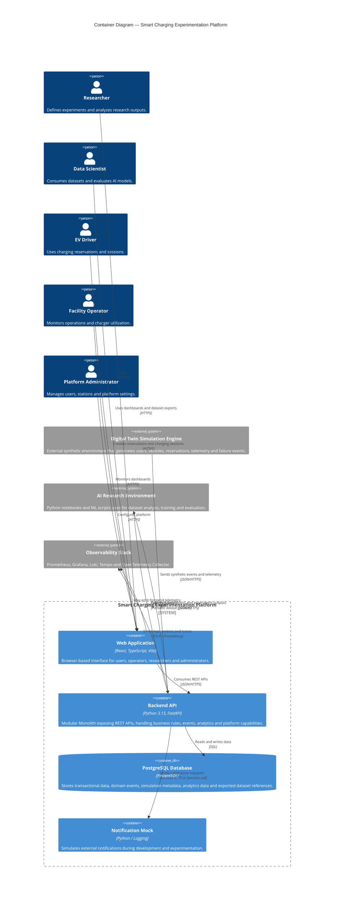

# Architecture View 003 — Container Diagram

## Smart Charging Experimentation Platform (SCEP)

**Status:** Approved

**Version:** 1.0

**Document Owner:** Project Team

**Last Update:** 2026

---

# 1. Purpose

This document presents the **C4 Model Level 2 — Container Diagram** for the **Smart Charging Experimentation Platform (SCEP)**.

The objective is to describe the main executable and deployable units of the platform, their responsibilities and how they communicate.

This document does not describe internal application modules, classes, packages or database schemas. These details will be covered in component-level and functional specification documents.

---

# 2. Scope

This document describes the following containers:

* Web Application;
* Backend API;
* PostgreSQL Database;
* Digital Twin Simulation Engine;
* AI Research Environment;
* Observability Stack;
* Notification Mock.

The diagram reflects the target local development and experimentation environment.

Production deployment is outside the scope of this document.

---

# 3. Container Diagram



---

# 4. Containers

## 4.1 Web Application

The Web Application is the browser-based user interface of SCEP.

It is used by:

* Researchers;
* Data Scientists;
* EV Drivers;
* Facility Operators;
* Platform Administrators.

Responsibilities:

* provide access to platform workflows;
* allow EV Drivers to create and manage reservations;
* allow EV Drivers to start and finish charging sessions;
* allow Facility Operators to inspect operational dashboards;
* allow Researchers to execute or inspect experiments;
* allow Platform Administrators to configure users, roles and chargers;
* display prediction results and operational metrics.

Technology:

* React;
* TypeScript;
* Vite.

Communication:

* communicates with the Backend API through REST APIs;
* may emit frontend telemetry in future versions.

---

## 4.2 Backend API

The Backend API is the main application container of SCEP.

It implements the Modular Monolith described in the Architecture Vision.

Responsibilities:

* expose REST APIs;
* enforce authentication and authorization;
* execute Smart Charging business rules;
* manage charging stations;
* manage reservations;
* manage charging sessions;
* ingest telemetry events;
* persist domain events;
* provide analytics endpoints;
* export datasets;
* receive prediction results;
* emit observability signals.

Technology:

* Python 3.13;
* FastAPI;
* SQLAlchemy;
* Pydantic;
* Alembic.

Architectural style:

* Modular Monolith;
* Event-Driven internally;
* Clean Architecture principles;
* API First.

The Backend API must not assume whether events are produced by real users, simulated users or future physical chargers. All event producers must interact through explicit APIs.

---

## 4.3 PostgreSQL Database

The PostgreSQL Database is the primary persistence container.

Responsibilities:

* store users and roles;
* store charging stations;
* store reservations;
* store charging sessions;
* store telemetry records;
* store domain events;
* store simulation metadata;
* store analytics aggregations;
* store dataset export metadata;
* store prediction results.

Technology:

* PostgreSQL.

Rationale:

PostgreSQL was selected because it supports transactional consistency, relational modeling, temporal queries and analytical workloads sufficiently well for the project scope.

The database is shared by the Modular Monolith, but module boundaries must be preserved at the application level.

Direct database access from external systems is not allowed.

---

## 4.4 Digital Twin Simulation Engine

The Digital Twin Simulation Engine is an external container responsible for generating synthetic Smart Charging behavior.

It is intentionally placed outside the SCEP system boundary.

Responsibilities:

* simulate EV Drivers;
* simulate vehicles;
* simulate charger usage;
* simulate reservation creation and cancellation;
* simulate charging sessions;
* simulate telemetry;
* simulate failures;
* simulate maintenance windows;
* simulate demand peaks;
* execute reproducible scenarios.

Communication:

* sends data to SCEP through public REST APIs;
* never accesses SCEP internal modules directly;
* never writes directly to the database.

Technology:

* Python;
* configurable simulation scripts;
* deterministic random generation using seeds.

Architectural rationale:

Keeping the Simulation Engine external ensures that SCEP treats simulated producers and future real producers in the same way. This preserves system boundaries and prepares the platform for future integration with physical infrastructure.

---

## 4.5 AI Research Environment

The AI Research Environment is an external analytical container used by Data Scientists and Researchers.

Responsibilities:

* consume datasets exported by SCEP;
* train machine learning models;
* evaluate model performance;
* compare algorithms;
* generate experiment reports;
* optionally publish prediction results back to SCEP.

Technology:

* Python;
* notebooks;
* data analysis libraries;
* machine learning libraries.

Initial AI experiment:

* charger occupancy prediction.

Communication:

* consumes exported datasets;
* optionally calls Backend API to publish prediction results.

The AI Research Environment is intentionally decoupled from the transactional application. This prevents experimental machine learning code from contaminating business-critical application logic.

Portable export formats are controlled by the Dataset Export functional specification. SPEC-011
Version 1 selects CSV and Parquet; JSON is not required as a Version 1 data-file format.

---

## 4.6 Observability Stack

The Observability Stack provides visibility into platform behavior.

Responsibilities:

* collect metrics;
* collect structured logs;
* collect traces;
* provide dashboards;
* support debugging;
* support architectural evaluation;
* support performance analysis.

Technology:

* OpenTelemetry Collector;
* Prometheus;
* Grafana;
* Loki;
* Tempo.

The Observability Stack receives telemetry from:

* Backend API;
* Web Application;
* potentially Simulation Engine.

Observability is not optional. It is a required part of the experimentation environment.

---

## 4.7 Notification Mock

The Notification Mock represents notification infrastructure during development and experimentation.

Responsibilities:

* receive notification requests;
* log notification payloads;
* simulate successful notification delivery;
* support future replacement by real providers.

Examples of future providers:

* e-mail provider;
* SMS gateway;
* push notification service.

The mock exists to avoid introducing external commercial dependencies during the MVP.

---

# 5. Main Runtime Flows

## 5.1 User Interaction Flow

```text
User

    ↓

Web Application

    ↓

Backend API

    ↓

PostgreSQL Database

    ↓

Domain Events

    ↓

Analytics and Dashboards
```

Description:

A user interacts with the Web Application. The Backend API validates the operation, persists data and publishes domain events. These events later support analytics and research datasets.

---

## 5.2 Simulation Flow

```text
Digital Twin Simulation Engine

    ↓

Backend API

    ↓

Domain Validation

    ↓

PostgreSQL Database

    ↓

Domain Events

    ↓

Datasets and Metrics
```

Description:

The Simulation Engine executes a scenario and interacts with SCEP through public APIs. The Backend API treats simulated input as regular operational input.

---

## 5.3 AI Experimentation Flow

```text
PostgreSQL Database

    ↓

Backend API Dataset Export

    ↓

AI Research Environment

    ↓

Model Training

    ↓

Prediction Results

    ↓

Backend API

    ↓

Dashboards
```

Description:

The AI Research Environment consumes exported historical data, trains models and may return prediction results to SCEP for visualization.

---

## 5.4 Observability Flow

```text
Backend API / Web Application / Simulation Engine

    ↓

OpenTelemetry / Logs / Metrics

    ↓

Observability Stack

    ↓

Grafana Dashboards
```

Description:

Application and infrastructure telemetry is continuously collected and made available for monitoring and architectural analysis.

---

# 6. Communication Matrix

| Source                  | Target                  | Protocol / Format      | Purpose                        |
| ----------------------- | ----------------------- | ---------------------- | ------------------------------ |
| Web Application         | Backend API             | HTTPS / JSON           | Business operations            |
| Backend API             | PostgreSQL              | SQL                    | Persistence                    |
| Simulation Engine       | Backend API             | HTTPS / JSON           | Synthetic events and telemetry |
| Backend API             | AI Research Environment | Specification-controlled portable formats | Dataset export |
| AI Research Environment | Backend API             | HTTPS / JSON           | Prediction publishing          |
| Backend API             | Observability Stack     | OTLP, Prometheus, logs | Metrics, logs and traces       |
| Web Application         | Observability Stack     | OTLP or logs           | Frontend telemetry             |
| Backend API             | Notification Mock       | HTTP or internal call  | Notification simulation        |

---

# 7. Security Considerations

The container architecture must respect the following security principles:

* external systems never access the database directly;
* all business operations pass through the Backend API;
* APIs must enforce authentication and authorization;
* simulation clients must use explicit credentials or API tokens;
* dataset exports must avoid leaking sensitive user data;
* secrets must never be committed to version control;
* dependency scanning is mandatory in CI;
* public APIs must validate all inputs.

For the MVP, authentication may be simplified, but the architecture must preserve clear boundaries for future hardening.

---

# 8. Data Ownership

The Backend API owns all transactional data.

External systems may only interact through:

* REST APIs;
* dataset export mechanisms;
* explicit import endpoints.

The PostgreSQL Database is not an integration point.

The Simulation Engine does not own operational data after sending it to SCEP.

The AI Research Environment may produce models and predictions, but SCEP remains responsible for storing published prediction outputs.

---

# 9. Deployment Assumptions

The reference environment is local and containerized.

Expected local containers:

* web application;
* backend API;
* PostgreSQL;
* simulation engine;
* notification mock;
* Prometheus;
* Grafana;
* Loki;
* Tempo;
* OpenTelemetry Collector.

Cloud deployment is not required for the MVP.

The deployment model must remain reproducible using Docker Compose.

---

# 10. Architectural Constraints

The following constraints must be respected:

* the Backend API remains a Modular Monolith;
* the Simulation Engine remains external to SCEP;
* external systems communicate only through explicit APIs or exported datasets;
* observability must be available from the early stages of development;
* the database must not become a shared integration layer;
* AI experimentation must remain decoupled from transactional business logic;
* containers must be reproducible in local development.

---

# 11. Relationship with Other Documents

This document depends on:

* `001-architecture-vision.md`;
* `002-context-diagram.md`.

Future documents:

* `004-component-diagram-backend.md`;
* `005-data-view.md`;
* `008-deployment-runtime-view.md`;
* `006-quality-attributes.md`;
* architectural decision records under `docs/architecture/decisions/`.

---

# 12. Final Considerations

This container diagram defines the main executable building blocks of SCEP and clarifies the boundaries between operational software, simulation, AI experimentation and observability.

By keeping the Simulation Engine and AI Research Environment outside the SCEP boundary, the architecture preserves a clean separation between the core platform and experimental tools.

This decision reinforces the project's central goal: to provide a reproducible platform for Smart Charging experimentation while adopting modern Software Engineering practices.
