# Architecture View 004 — Backend Component Diagram

## Smart Charging Experimentation Platform (SCEP)

**Status:** Approved

**Version:** 1.0

**Document Owner:** Project Team

**Last Update:** 2026

---

# 1. Purpose

This document presents the **C4 Model Level 3 — Component Diagram** for the **Backend API** container of the Smart Charging Experimentation Platform (SCEP).

The objective is to describe the internal components of the Backend API, their responsibilities, boundaries and allowed dependencies.

This document does not define classes, database tables, endpoint schemas or implementation details. Those elements will be defined in functional specifications and implementation documents.

---

# 2. Scope

This document details only the **Backend API** container.

The Backend API is implemented as a **Modular Monolith** using Python and FastAPI.

The following containers are considered external from this document's perspective:

* Web Application;
* PostgreSQL Database;
* Digital Twin Simulation Engine;
* AI Research Environment;
* Observability Stack;
* Notification Mock.

---

# 3. Architectural Style

The Backend API follows a **Modular Monolith** architecture.

Each module represents a cohesive functional area and owns its domain logic, application services and persistence access.

Internal communication should occur through:

* explicit application services;
* domain events;
* interfaces;
* stable contracts.

Direct access to another module's internal implementation is not allowed.

The architecture is also influenced by:

* Domain-Driven Design;
* Clean Architecture;
* Event-Driven Architecture;
* API First design;
* Observability by Design;
* Security by Design.

---

# 4. Component Diagram

```mermaid
C4Component
    title Component Diagram — Backend API

    Container_Boundary(api, "Backend API — Python 3.13 / FastAPI Modular Monolith") {
        Component(apiLayer, "API Layer", "FastAPI Routers", "Exposes REST endpoints and handles request/response mapping.")
        Component(auth, "Identity & Access Component", "Application Module", "Handles authentication, authorization, users and roles.")
        Component(charging, "Smart Charging Component", "Application Module", "Manages charging stations, Vehicles, reservations, sessions and occupancy rules.")
        Component(telemetry, "Telemetry Component", "Application Module", "Ingests and normalizes operational telemetry.")
        Component(events, "Domain Event Component", "Event Store / Internal Event Dispatcher", "Transactionally persists events and dispatches them after commit.")
        Component(analytics, "Analytics Component", "Application Module", "Computes read-only indicators on demand from persisted operational data.")
        Component(datasets, "Dataset Export Component (Future)", "Application Module", "Will generate research datasets from historical data and events.")
        Component(prediction, "Prediction Component (Future)", "Application Module", "Will store prediction results and expose AI-related outputs.")
        Component(notification, "Notification Component", "Application Module", "Sends notification requests to the Notification Mock or future providers.")
        Component(observability, "Observability Component", "Cross-Cutting", "Emits logs, metrics, traces and health information.")
        Component(persistence, "Persistence Component", "SQLAlchemy / Repositories", "Provides controlled access to PostgreSQL.")
    }

    ContainerDb(db, "PostgreSQL Database", "Stores transactional data, domain events and telemetry; future capabilities may add analytical or dataset metadata.")
    System_Ext(simulator, "Digital Twin Simulation Engine", "Sends synthetic events and telemetry through public APIs.")
    System_Ext(aiEnv, "AI Research Environment", "Consumes datasets and publishes prediction results.")
    System_Ext(obsStack, "Observability Stack", "Prometheus, Grafana, Loki, Tempo, OpenTelemetry Collector.")
    System_Ext(notificationMock, "Notification Mock", "Simulates external notification delivery.")

    Rel(simulator, apiLayer, "Calls public APIs", "HTTPS/JSON")
    Rel(aiEnv, apiLayer, "Consumes datasets and publishes predictions", "HTTPS/JSON")
    Rel(apiLayer, auth, "Validates access")
    Rel(apiLayer, charging, "Executes charging workflows")
    Rel(apiLayer, telemetry, "Ingests telemetry")
    Rel(apiLayer, datasets, "Requests dataset exports")
    Rel(apiLayer, prediction, "Reads or publishes predictions")

    Rel(charging, events, "Publishes domain events")
    Rel(telemetry, events, "Publishes telemetry events")
    Rel(events, analytics, "May provide future projection input")
    Rel(events, datasets, "Provides event history")
    Rel(analytics, prediction, "Provides indicators for AI outputs")
    Rel(notification, notificationMock, "Sends notification requests")

    Rel(auth, persistence, "Reads and writes")
    Rel(charging, persistence, "Reads and writes")
    Rel(telemetry, persistence, "Reads and writes")
    Rel(events, persistence, "Persists events")
    Rel(analytics, persistence, "Reads operational data")
    Rel(datasets, persistence, "Reads historical data")
    Rel(prediction, persistence, "Reads and writes prediction results")

    Rel(persistence, db, "SQL")
    Rel(observability, obsStack, "Emits logs, metrics and traces", "OTLP / Prometheus")
    Rel(apiLayer, observability, "Reports request telemetry")
    Rel(charging, observability, "Reports domain metrics")
    Rel(telemetry, observability, "Reports ingestion metrics")
    Rel(events, observability, "Reports event metrics")
```



---

# 5. Component Responsibilities

## 5.1 API Layer

The API Layer exposes the platform capabilities through REST endpoints.

Responsibilities:

* receive HTTP requests;
* validate request payloads;
* map external DTOs to application commands;
* map application results to HTTP responses;
* enforce authentication requirements;
* expose OpenAPI documentation;
* provide stable public contracts for external clients.

The API Layer must not contain business rules.

Business decisions belong to application and domain components.

---

## 5.2 Identity & Access Component

The Identity & Access Component provides authentication and authorization capabilities.

Responsibilities:

* user registration;
* user authentication;
* role management;
* permission validation;
* token validation;
* access control enforcement.

Initial roles include:

* Researcher;
* Data Scientist;
* EV Driver;
* Facility Operator;
* Platform Administrator;
* Technical Client account type.

The Technical Client account type is used by the external Digital Twin Simulation Engine to
interact with SCEP through public APIs. It is not a Human Role.

---

## 5.3 Smart Charging Component

The Smart Charging Component represents the main business domain of the platform.

Responsibilities:

* manage charging stations;
* manage charger status;
* manage the minimal Vehicle capability required by Reservations;
* create reservations;
* cancel reservations;
* validate reservation conflicts;
* start charging sessions;
* finish charging sessions;
* manage occupancy rules;
* publish charging-related Domain Events as defined by SPEC-009.

This component owns the core operational rules of the Smart Charging domain.

Vehicle remains a supporting domain entity inside this component. It does not introduce a new
component, module boundary or deployable service.

It must not directly execute analytics, model training or notification delivery.

Those concerns belong to other components.

---

## 5.4 Telemetry Component

The Telemetry Component ingests and normalizes operational telemetry.

Responsibilities:

* receive telemetry events;
* validate telemetry payloads;
* normalize telemetry data;
* associate telemetry with Charging Sessions;
* persist telemetry records;
* publish TelemetrySampleReceived as defined by SPEC-009.

Telemetry may originate from:

* Digital Twin Simulation Engine;
* test scripts;
* future real charging infrastructure.

The component must not depend on a specific physical charger protocol.

---

## 5.5 Domain Event Component

The Domain Event Component provides event publication, persistence and dispatching.

Responsibilities:

* define the domain event envelope;
* persist emitted events in the same transaction as the originating business state;
* dispatch persisted events to internal consumers after commit with at-least-once delivery;
* provide event history for analytics and datasets;
* support future integration with external brokers.

The initial design uses an in-process Internal Event Dispatcher backed by a persistent Event Store.

Future specifications may add an Outbox and Kafka transport without changing current producer,
Event Store or Internal Event Dispatcher responsibilities.

Events must represent facts that already happened.

They must not be used to request business validation from other modules.

---

## 5.6 Analytics Component

The Analytics Component transforms persisted operational records into indicators.

Responsibilities:

* query persisted operational data without modifying it;
* calculate operational metrics;
* aggregate historical data;
* expose analytical queries;
* expose read-only aggregate and time-series queries.

Examples of calculated indicators:

* charger utilization rate;
* occupancy by time window;
* no-show rate;
* cancellation rate;
* average session duration;
* delivered energy;
* charger availability.

Analytics must be read-oriented and must not change transactional business behavior.

Smart Charging is the initial analytical domain. The component architecture remains independent
from any one analytical domain, and version 1 does not require Domain Events.

---

## 5.7 Dataset Export Component

The Dataset Export Component produces research datasets from operational and simulated data.

Responsibilities:

* export historical data;
* export domain events;
* export telemetry records;
* export simulation metadata;
* generate dataset metadata;
* provide reproducible dataset extraction.

Supported output formats may include:

* CSV;
* JSON;
* Parquet.

The component supports AI experimentation but does not train models itself.

---

## 5.8 Prediction Component

The Prediction Component stores and exposes AI-related outputs.

Responsibilities:

* receive prediction results from the AI Research Environment;
* persist prediction outputs;
* expose prediction results to the Web Application;
* associate predictions with time windows, stations or experiments;
* provide prediction metrics when available.

The component does not own model training.

Training remains external in the AI Research Environment.

---

## 5.9 Notification Component

The Notification Component abstracts communication with notification providers.

Responsibilities:

* receive notification requests from application workflows;
* format notification messages;
* send messages to the Notification Mock;
* support future replacement by real providers.

Initial notifications may include:

* reservation confirmation;
* reservation cancellation;
* charging session started;
* charging session finished;
* station fault detected.

---

## 5.10 Observability Component

The Observability Component centralizes technical telemetry emission.

Responsibilities:

* emit structured logs;
* emit application metrics;
* emit domain metrics;
* emit traces;
* expose health checks;
* expose readiness checks;
* expose liveness checks.

Observability is cross-cutting and may be used by every component.

It must not contain business logic.

---

## 5.11 Persistence Component

The Persistence Component provides controlled access to PostgreSQL.

Responsibilities:

* implement repositories;
* manage database sessions;
* execute migrations through Alembic;
* isolate persistence details from application logic;
* support transactional consistency.

No component should execute raw database access outside the persistence boundaries defined for its module.

External containers must never access PostgreSQL directly.

---

# 6. Dependency Rules

The Backend API must respect the following dependency rules.

## Allowed

* API Layer may call application services.
* Application components may call their own repositories.
* Application components may publish domain events.
* Analytics reads persisted operational data in version 1 and may consume event history in a future version.
* Dataset Export may read historical records.
* Prediction may store AI outputs.
* Observability may be used by any component.

## Forbidden

* API Layer must not contain business rules.
* Business components must not access another component's database tables directly.
* Analytics must not change transactional business state.
* Prediction must not train models inside transactional workflows.
* Simulation Engine must not access internal components directly.
* External systems must not connect directly to PostgreSQL.
* Components must not bypass authentication or authorization.

---

# 7. Internal Event Flow

```text
Business Operation

    ↓

Application Service

    ↓

Domain Rule Validation

    ↓

State Change

    ↓

Domain Event Emitted

    ↓

Event Persisted

    ↓

Event Dispatched

    ↓

Future projections / Dataset / Notification / Observability
```

Example:

```text
Reservation Created

    ↓

ReservationCreated Event

    ↓

Event Store

    └──► Internal consumers

Persisted Reservation

    └──► Version 1 Analytics on-demand query
```

---

# 8. Public API Groups

The Backend API should expose API groups aligned with component boundaries.

Initial API groups:

* `/auth`
* `/users`
* `/vehicles`
* `/stations`
* `/reservations`
* `/sessions`
* `/telemetry`
* `/analytics`
* `/datasets`
* `/predictions`
* `/experiments`
* `/health`

These groups represent public contracts.

Their internal implementation may evolve without changing the external API contract unnecessarily.

---

# 9. Data Access Strategy

Each application module owns its persistence access through repositories.

Although all modules share the same PostgreSQL database, ownership is logical.

Recommended separation:

* Identity tables belong to Identity & Access.
* Charging tables belong to Smart Charging.
* Telemetry tables belong to Telemetry; their immutable observations reference Charging Sessions
  owned by Smart Charging.
* Event tables belong to Domain Event.
* Version 1 Analytics owns no tables and never modifies operational data.
* Prediction tables belong to Prediction.

Dataset Export may read from multiple modules, but only for read-only analytical purposes.

---

# 10. Observability Requirements by Component

## API Layer

Must emit:

* request count;
* request latency;
* HTTP status distribution;
* authentication failures.

## Smart Charging Component

Must emit:

* reservation count;
* reservation cancellation count;
* charging session count;
* station occupancy;
* conflict validation failures.

## Telemetry Component

Must emit:

* telemetry ingestion count;
* invalid telemetry count;
* ingestion latency.

## Domain Event Component

Must emit:

* event publication count;
* event persistence failures;
* event dispatch latency.

## Analytics Component

Must emit:

* aggregation execution time;
* metric refresh count;
* analytical query latency.

## Dataset Export Component

Must emit:

* dataset export count;
* dataset export duration;
* exported record count.

## Prediction Component

Must emit:

* prediction import count;
* prediction query latency;
* prediction error metrics when available.

---

# 11. Security Requirements by Component

## API Layer

* validate request payloads;
* enforce authentication;
* enforce authorization;
* reject malformed input.

## Identity & Access

* protect credentials;
* avoid storing plain-text passwords;
* support role-based access control.

## Smart Charging

* prevent unauthorized reservation changes;
* prevent unauthorized station configuration.

## Telemetry

* require authenticated producer credentials;
* reject invalid station identifiers;
* reject malformed telemetry.

## Dataset Export

* restrict dataset generation to authorized users;
* avoid exposing sensitive user attributes unnecessarily.

## Prediction

* restrict prediction publishing to authorized AI clients or Data Scientists.

---

# 12. Testing Implications

The component structure implies the following test strategy:

* API Layer tests validate routing, schemas and HTTP behavior.
* Domain tests validate Smart Charging business rules.
* Telemetry tests validate payload normalization.
* Event tests validate publication and persistence.
* Analytics tests validate metrics calculation.
* Dataset tests validate export correctness and reproducibility.
* Prediction tests validate input contracts and persistence.
* Architecture tests validate dependency rules.

The test suite must prevent architectural erosion.

---

# 13. Relationship with Other Documents

This document depends on:

* `001-architecture-vision.md`;
* `002-context-diagram.md`;
* `003-container-diagram.md`.

Future documents:

* `005-data-view.md`;
* `006-observability-view.md`;
* `007-quality-attributes.md`;
* `ADR-001-modular-monolith.md`;
* `ADR-002-python-fastapi.md`;
* `ADR-003-event-driven.md`.

---

# 14. Final Considerations

This component diagram defines the internal structure of the Backend API container.

The design intentionally keeps operational business logic, telemetry ingestion, analytics, dataset export and AI outputs separated into distinct components.

This separation supports the main goal of SCEP: providing a research-oriented Smart Charging experimentation platform that remains modular, observable, testable and extensible.

All implementation decisions inside the Backend API must preserve the component boundaries described in this document.
